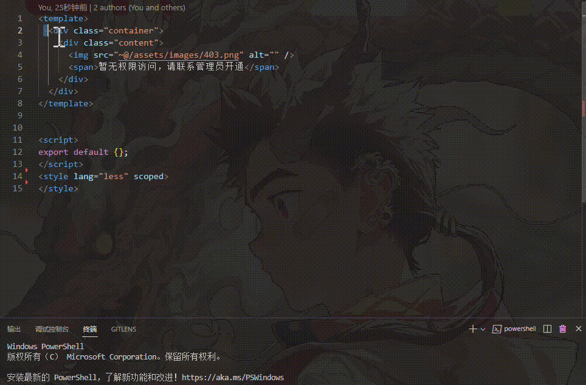
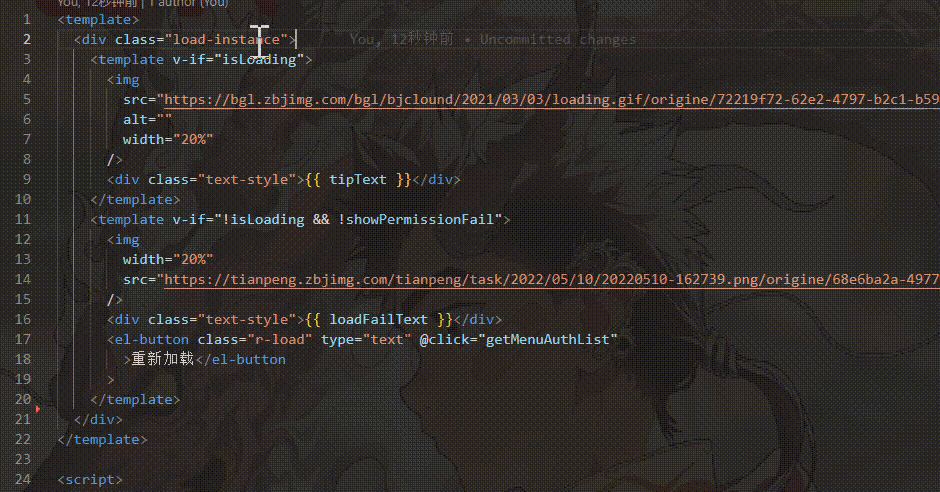
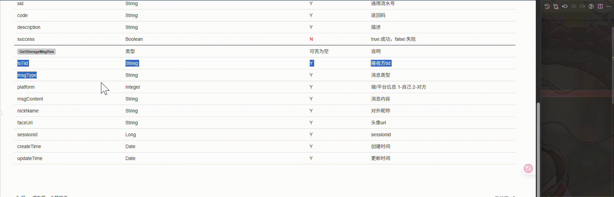

# 前端百宝箱

打造一个前端开发的辅助工具，集成多个功能，帮助前端开发人员提高效率，减少重复工作，提升开发质量。

## 1.目前功能

- 框选对应前端模板代码生成 CSS 样式结构
- 显示该class对应的css结构
- 点击对应class名，自动跳定位到该class名所对应的css结构位置
- 点击对应属性值，快速定位到该值定义位置或赋值位置
- 根据接口文档结构生成mock数据（目前只支持一级生成）

## 2.如何使用
### 1.快速查看属性值定义赋值位置方法

1. 打开任意前端html代码文件
2. 鼠标移入对应代码里面的属性值
3. 通过Ctrl+鼠标左键点击对应属性值，将自动跳转到该属性值定义位置或赋值位置，如果存在多个位置，则会以弹窗进行选择查看

### 2.快速生成css结构运行命令方法

1. 打开任意前端html代码文件
2. 选中需要生成 CSS 样式的代码片段
3. 鼠标右键选中快速生成css结构

### 3.查看该class名称所对应的css结构和跳转定位

1. 打开任意前端html代码文件
2. 鼠标移入对应的class名称即可查看该class的样式结构
3. 通过Ctrl+鼠标左键点击对应class名，将自动跳转到该class名所对应的css结构位置

### 4.根据接口文档结构生成mock数据（目前只支持一级生成）

1. 在接口文档中复制接口文档结构
2. 鼠标移入对应的需要生成mock的位置鼠标右键点击打开菜单
3. 点击根据接口文档格式生成Mock数据
4. 填入复制的结构-回车确认
5. 填入需要生成多少条数据-回车确认

## 3.扩展设置

本扩展提供以下配置选项：

* `generateCssTree.cssFlavor`:
  - 指定要使用的 CSS 预处理器类型
  - 可选值：`scss`、`less`、`css`
  - 默认值为 `scss`
